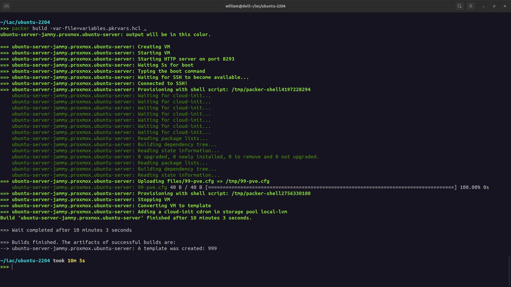
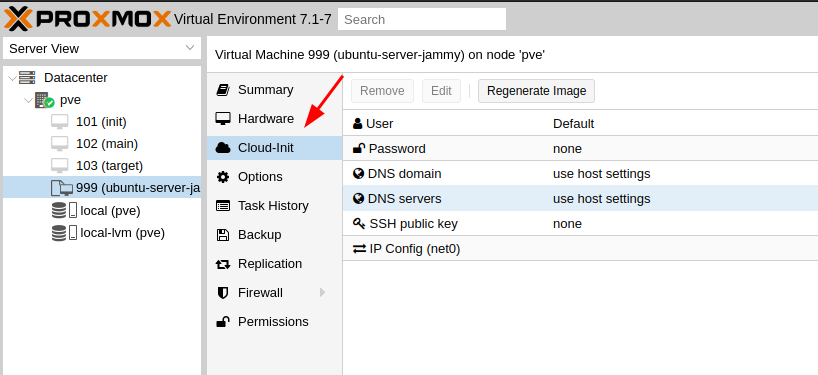

# packer-ubuntu-22-04
Arquivos de configuração para a criação de template do Ubuntu Server 22.04 no hyperviso Proxmox.

## Pré-equisitos

Crie uma __chave__ e __token__ de acesso, conforme este exemplo: [Proxmox](https://registry.terraform.io/providers/Telmate/proxmox/latest/docs).

Agora exporte a chave, token e url de conxão em seu terminal;

```
export PROXMOX_URL=https://pve.homelab.app.br/api2/json
export PROXMOX_USERNAME=william@pve!token
export PROXMOX_TOKEN=xxxxx-xxxxx-xxxxx-xxxxx-xxxxx
```

Execute os comandos as baixos para buildar o template.
```
packer init -var-file=variables.pkrvars.hcl .
packer build -var-file=variables.pkrvars.hcl  .
```


Lembre-se, a costrução deste template é em cima do Cloud-Init, sendo assim, a configuração de novas VMs a partir dele também deverá seguir este padrão.
Resumindo, após o clone do template para uma nova VM, configure o usuário, senha,
IP, DNS, DOMAIN e SSH Key pela aba através da aba **Cloud-Iinit**



